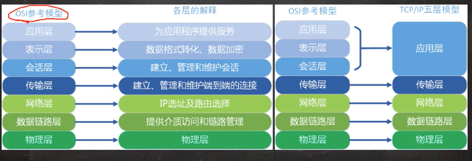
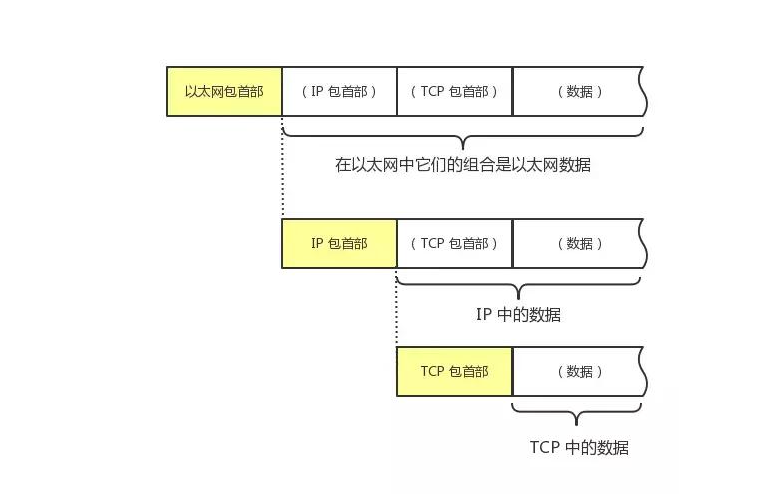
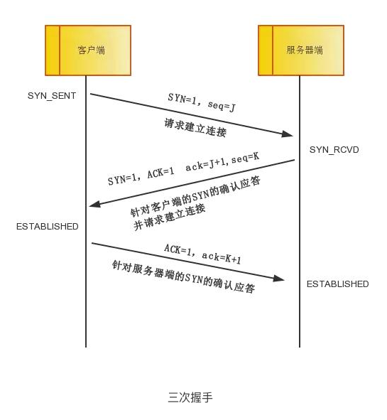
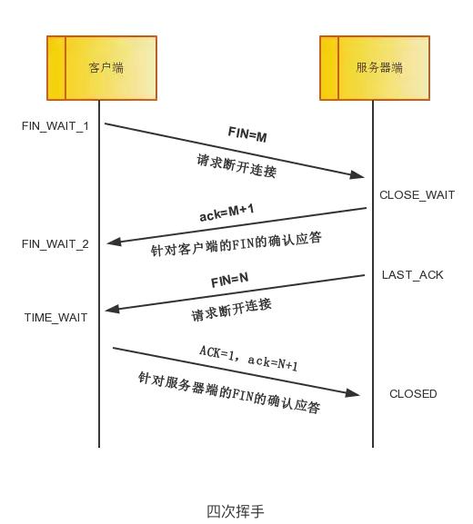
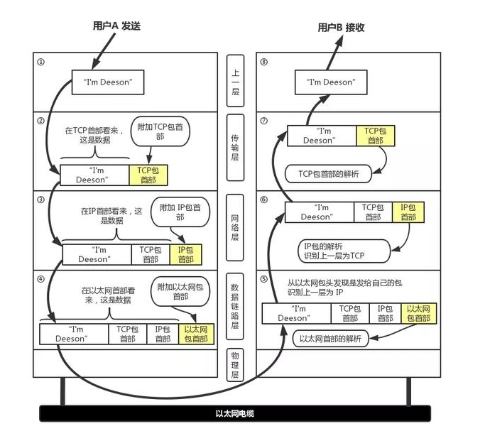
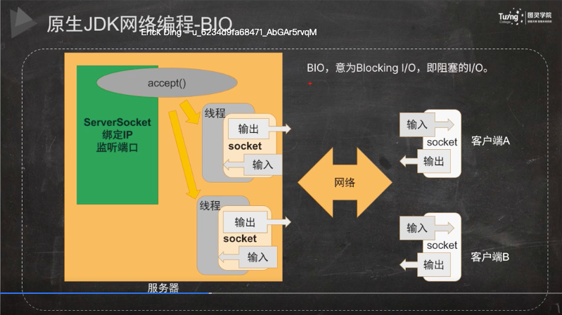
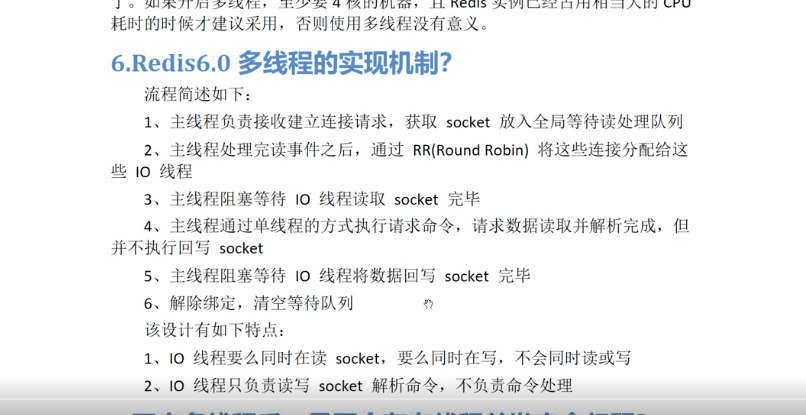

# 网络编程

## 网络模型

- 网络抓包工具 tcpdump 和 Wireshark

- OSI 七层模型

- 物理层-网卡、网线 最底层
- 数据链路层-交换机 mac地址 驱动程序
- 网络层-路由器 ip
- 传输层-端口 tcp
- 会话层-建立拆除会话链接
- 表示层-负责数据加密
- 应用层-接口 mysql

- 1.tcp/ip层数据的包装是由操作系统帮我们做了

- 2.mac地址是硬件绑定，在制作网卡的过层中写死了；

- 3.端口号只有65535个，因为端口占2字节，一字节8个bit位，结果为2的16次方个，除了0就是65535

- 4.端口 0-1023，存放知名端口号
  http：80/ftp：21/ssh：22

- 5.一台机器可能有多网卡的，一个网卡对应一个ip地址

## tcp 面向链接的协议
**超时重传**和**应答确认机制**是tcp可靠传输的关键设计

### 1.三次握手&四次挥手

三次握手

四次挥手（终端链接的可以是客户端，也可以是服务端；time_wait状态是存在于发起挥手的一端）

> tcp协议中通过三次握手来建立链接，在socket编程中，这一过程由客户端执行connect来触发。即socket包装了三次握手的过程，不需要工程师每次都进行三次握手操作

> syn洪泛攻击
>
> tcp_max_syn_backlog 是服务端用来维护同时正处于半链接状态的tcp请求，即客户端发送的syn请求，会存放在该队列，等链接完成就会从队列删除
>
> cat /proc/sys/net/ipv4/tcp_max_syn_backlog 服务器
>
>
> 如何解决
1.无效链接监控释放
2.防火墙

### 2.特性
- 可靠的
- 面向连接的
- 面向字节流
- **全双工** 建立链接之后，客户端和服务端可以同时相互发送数据

### 3.可靠性如何保证
- 1.ack确认机制，收不到回调，过一点时间会重新发送
- 2.文件大小校验，头部用两个字节记录了消息的大小
- 3.需要解决乱序问题
- 4.流量控制
- 5.拥塞控制

### 4.超时重发

> 重发超时是指在重发数据之前，等待确认应答到来的那个特定时间间隔。如果超过这个时间仍未收到确认应答，发送端将进行数据重发。最理想的是，找到一个最小时间，它能保证“确认应答一定能在这个时间内返回”。
TCP 要求不论处在何种网络环境下都要提供高性能通信，并且无论网络拥堵情况发生何种变化，都必须保持这一特性。为此，它在每次发包时都会计算往返时间及其偏差。将这个往返时间和偏差时间相加，重发超时的时间就是比这个总和要稍大一点的值。
在 BSD 的 Unix 以及 Windows 系统中，超时都以0.5秒为单位进行控制，因此重发超时都是0.5秒的整数倍。不过，最初其重发超时的默认值一般设置为6秒左右。
数据被重发之后若还是收不到确认应答，则进行再次发送。此时，等待确认应答的时间将会以2倍、4倍的指数函数延长。
此外，数据也不会被反复地重发。达到一定重发次数之后，如果仍没有任何确认应答返回，就会判断为网络或对端主机发生了异常，强制关闭连接。并且通知应用通信异常强行终止。

### 5.流量控制

服务端在回复ack时，会将自己缓冲区的大小带上，返回给发送端。发送端根据缓冲区的空闲部分，调整发送策略
如果缓冲区大小为0，客户端就停止发送

### 6.数据处理流程

## socket网络编程（链接：客户端链接服务端，服务端等待客户端链接；读网络数据；写网络数据）

### RPC 和 HTTP
> rpc 字面意思就是远程过程调用，只是对不同应用间相互调用的一种描述，一种思想。
具体怎么调用?实现方式可以是最直接的 tcp 通信，也可以是 http 方式，在很多的消息中间 件的技术书籍里，
甚至还有使用消息中间件来实现 RPC 调用的，
我们知道的 dubbo 是基于 tcp 通信的，gRPC 是 Google 公布的开源软件，基于最新的 HTTP2.0 协议，底层使用到了 Netty 框架的支持。
所以总结来说，rpc 和 http 是完全两个不同层级的东西，他们之间并没有什么 可比性。

### 实现rpc框架需要解决哪些问题

> 1.代理
> 代理本质上是要解决什么问题?要解决的是被调用的服务本质上是远程的服务，但是调 用者不知道也不关心，调用者只要结果，具体的事情由代理的那个对象来负责这件事。既然 是远程代理，当然是要用代理模式了。
代理(Proxy)是一种设计模式,即通过代理对象访问目标对象.这样做的好处是:可以在目 标对象实现的基础上,增强额外的功能操作,即扩展目标对象的功能。那我们这里额外的功能 操作是干什么，通过网络访问远程服务
>
> 2.序列化
> 序列化问题在计算机里具体是什么?我们的方法调用，有方法名，方法参数，这些可能 是字符串，可能是我们自己定义的 java 的类，但是在网络上传输或者保存在硬盘的时候， 网络或者硬盘并不认得什么字符串或者 javabean，
> 它只认得二进制的 01 串，怎么办?要进 行序列化，网络传输后要进行实际调用，就要把二进制的 01 串变回我们实际的 java 的类， 这个叫反序列化。java 里已经为我们提供了相关的机制 Serializable
>
> 3.通信
> 我们在用序列化把东西变成了可以在网络上传输的二进制的 01 串，但具体如何通过网 络传输?使用 JDK 为我们提供的 BIO。
>
> 4.登记服务实例化
> 登记的服务有可能在我们的系统中就是一个名字，怎么变成实际执行的对象实例，当然 是使用反射机制。
> 

### BIO

bio 的阻塞，主要体现在两个地方。

> 1.若一个服务器启动就绪，那么主线程就一直在等待着客户端的连接，这个等待过程中主线程就一直在阻塞。
>
> 2.在连接建立之后，在读取到 socket 信息之前，线程也是一直在等待，一直处于阻塞 的状态下的。

- serverSocket 绑定端口，accept接收连接（accept会阻塞）
- client 通过socket连接服务器，通过ip+端口

改进
- 1.改进一：accept方法，每次创建一个线程，处理一个链接。问题：一万个链接就需要一万个线程
- 2.改进二：使用线程池处理accept方法。问题：线程池也有可能不够用

### NIO

- 1.**可以做到一个线程处理很多个链接**
- 2.reactor模型
- 3.Java NIO 和 IO 之间第一个最大的区别是，IO 是面向流的，NIO 是面向缓冲区的

特性：
- selector：选择器
- channel：底层其实就是socket
- buffer：面向缓存；每一个socket都有自己的输入缓冲区和输出缓冲区；使用的是**直接内存**

- ServerSocketChannel：用于接口连接，对应BIO的serverSocket,关注OP_ACCEPT 接收链接事件
- SocketChannel：对应BIO的Socket，关注 发起链接、读、写事件
- buffer：socketChannel读到数据之后并不是直接和应用程序交互，而是 先写入buffer中，由buffer和应用冲虚交互
- SelectionKey：四个事件，read、write、accept（接收链接）、connect（注册链接）

- OP_WRITE事件表示**写缓冲区中如果有空闲空间**，就会触发
- OP_READ事件表示**读缓冲区有数据就会触发**

> TCP/IP是传输层协议，主要解决数据如何在网络中传输；而HTTP是应用层协议，主要解决如何包装数据。
>
> Socket是对TCP/IP协议的封装，Socket本身并不是协议，而是一个调用接口（API），通过Socket，我们才能使用TCP/IP协议
>
> http连接：http连接就是所谓的短连接，即客户端向服务器端发送一次请求，服务器端响应后连接即会断掉；
>
> socket连接：socket连接就是所谓的长连接，理论上客户端和服务器端一旦建立起连接将不会主动断掉；但是由于各种环境因素可能会是连接断开，比如说：服务器端或客户端主机down了，网络故障，或者两者之间长时间没有数据传输，网络防火墙可能会断开该连接以释放网络资源。所以当一个socket连接中没有数据的传输，那么为了维持连接需要发送心跳消息~~具体心跳消息格式是开发者自己定义的

### Linux下的IO复用编程

- 1.select
- 2.poll
- 3.epoll

epoll为什么高效

中断信号：各组件会在CPU上注册一个中断信号，可以理解为是硬件层面的一个电原件

evevtPoll 存放的是文件描述符
rdlist 存放的是有数据的socket连接

三者的比较

单线程的reactor模型 redis6.0之前都是该模式
多线程主从reactor模型 redis6.0之后改为该模式

## udp
- 1.无状态
- 2.不需要事先建立连接就可以发包
- 3.顺序发包、乱序收
- 4.没有确认机制，不保证消息一定到达

## TFO
能够让经历过一次正常的三次握手之后，能够在之后的三次我握手中，在发送第一个 SYN 包的时候就开始传数据了
是基于cookie实现的

## HTTP
TCP 是传输控制协议，基于 IP 协议来提供可靠的字节流形式的通信，是 HTTP 的基础，HTTP 不关心传输的细节，其实是运行在了 TCP 协议上
TCP工作在传输层，HTTP工作在应用层

# netty

## 

- eventLoopGroup负责管理eventLoop
- 1.eventLoop对应多个channel，但是一个channel只会和一个eventLoop绑定
- 2.每个channel都有自己的ChannelPipline，ChannelPipline是存放ChannelHandler的容器
- 3.ChannelPipline是一个双向链表
- 4.ChannelHandlerContext 报文会在所有handler中被传递

> Channel、ChannelPipeline 和 ChannelHandlerContext 上的事件传播
> 
> 如果调用Channel 或者ChannelPipeline 上 的这些方法，它们将沿着整个 ChannelPipeline 进行传播。
而调用位于 ChannelHandlerContext 上的相同方法，则将从当前所关联的 ChannelHandler 开始，
并且只会传播给位于该 ChannelPipeline 中的下一个(入站下一个，出站上一个)能够处理该事件的 ChannelHandler

# Netty Project

Netty is an asynchronous event-driven network application framework for rapid development of maintainable high performance protocol servers & clients.

## Links

* [Web Site](https://netty.io/)
* [Downloads](https://netty.io/downloads.html)
* [Documentation](https://netty.io/wiki/)
* [@netty_project](https://twitter.com/netty_project)

## How to build

For the detailed information about building and developing Netty, please visit [the developer guide](https://netty.io/wiki/developer-guide.html).  This page only gives very basic information.

You require the following to build Netty:

* Latest stable [Oracle JDK 7](http://www.oracle.com/technetwork/java/)
* Latest stable [Apache Maven](http://maven.apache.org/)
* If you are on Linux, you need [additional development packages](https://netty.io/wiki/native-transports.html) installed on your system, because you'll build the native transport.

Note that this is build-time requirement.  JDK 5 (for 3.x) or 6 (for 4.0+) is enough to run your Netty-based application.

## Branches to look

Development of all versions takes place in each branch whose name is identical to `<majorVersion>.<minorVersion>`.  For example, the development of 3.9 and 4.0 resides in [the branch '3.9'](https://github.com/netty/netty/tree/3.9) and [the branch '4.0'](https://github.com/netty/netty/tree/4.0) respectively.

## Usage with JDK 9

Netty can be used in modular JDK9 applications as a collection of automatic modules. The module names follow the
reverse-DNS style, and are derived from subproject names rather than root packages due to historical reasons. They
are listed below:

 * `io.netty.all`
 * `io.netty.buffer`
 * `io.netty.codec`
 * `io.netty.codec.dns`
 * `io.netty.codec.haproxy`
 * `io.netty.codec.http`
 * `io.netty.codec.http2`
 * `io.netty.codec.memcache`
 * `io.netty.codec.mqtt`
 * `io.netty.codec.redis`
 * `io.netty.codec.smtp`
 * `io.netty.codec.socks`
 * `io.netty.codec.stomp`
 * `io.netty.codec.xml`
 * `io.netty.common`
 * `io.netty.handler`
 * `io.netty.handler.proxy`
 * `io.netty.resolver`
 * `io.netty.resolver.dns`
 * `io.netty.transport`
 * `io.netty.transport.epoll` (`native` omitted - reserved keyword in Java)
 * `io.netty.transport.kqueue` (`native` omitted - reserved keyword in Java)
 * `io.netty.transport.unix.common` (`native` omitted - reserved keyword in Java)
 * `io.netty.transport.rxtx`
 * `io.netty.transport.sctp`
 * `io.netty.transport.udt`

Automatic modules do not provide any means to declare dependencies, so you need to list each used module separately
in your `module-info` file.
